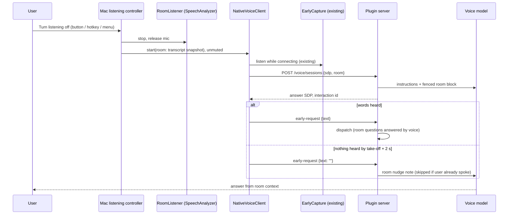
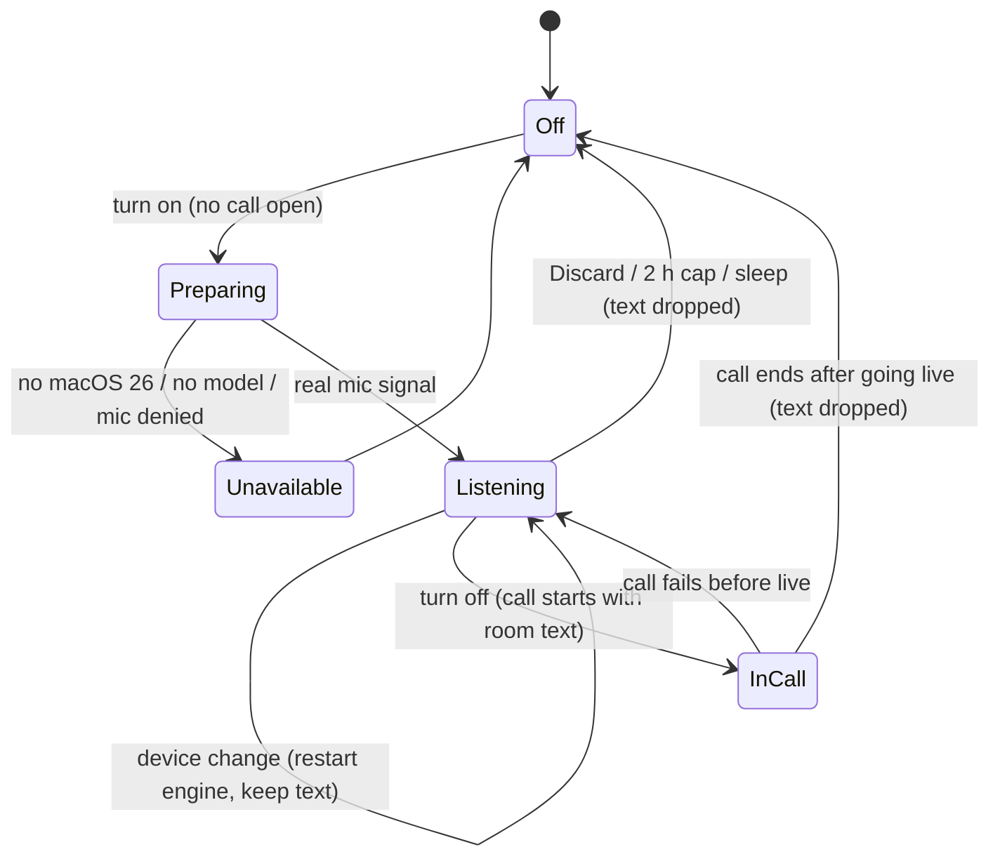

# feat: Listening mode

## Summary

Add a listening mode to the Mac app, used during a call. Turning it on pauses the call; while it is on, the Mac transcribes the room on-device and the voice never answers. Turning it off resumes the call, which now has the last 30 minutes of what was said. Whatever the user says in the next ~2 seconds is the request. If they say nothing, the voice responds from the context. The feature sits beside the existing call flow, so calls that don't come from listening mode behave exactly as they do today.

---

## Problem Frame

Speakeasy only knows what is said during a call. A user in a meeting or a conversation who wants help ("what did Sam say the deadline was?", "email Dana what we just agreed") has to recap everything first. Buddy proved the value of an assistant that has been in the room the whole time. Speakeasy can offer that without a paid voice session running, by transcribing on the Mac and handing the transcript to the call only when the user asks.

The user's constraints: no wake word for now, a simple on/off button, and as few changes as possible to the existing stack so current behavior is untouched.

---

## Requirements

**Listening**
- R1. During a call, the user turns listening mode on from the panel, the menu bar, or an optional shortcut; that pauses the call. Speakeasy never turns it on by itself, and it isn't offered outside a call.
- R2. While on, the Mac transcribes the room on-device and never answers. No audio or text leaves the Mac, and no voice session is open.
- R3. The menu bar and panel show that listening is on and for how long. "Listening" appears only once real mic signal arrives. Preparing, unavailable and failed states say so honestly.
- R4. Speakeasy keeps only the last 30 minutes of transcript, within a size cap. Listening stops itself after 2 hours and when the Mac sleeps, discards what it heard, and says so.
- R5. A Discard control stops listening and drops everything without starting a call.

**Turning it off**
- R6. Turning listening off (panel, Resume, menu bar, call or pause hotkey, shortcut) resumes the call with the room transcript as context.
- R7. Words said while the call connects, or within ~2 seconds of turning listening off, are the request. The voice answers questions about the room itself and hands real work to Hermes as usual.
- R8. If nothing is said, the voice responds from the context. It takes up a question or task from the end of the transcript, or briefly says what it heard and asks what the user needs.
- R9. Hermes tasks started in that call receive the room transcript as labeled background.
- R10. If the call can't come back, what was heard is kept (not listening) so it can still be asked about in a new call, or discarded.

**Boundaries**
- R11. The voice and Hermes treat room speech as background, never as instructions.
- R12. The room transcript lives in memory only, on the Mac and the server. It is never written to the call log, recent-voice context, Tune input or chat-thread posts. It is dropped when the call that used it ends, but kept across that call's pause and resume. The call's own turns are logged as usual.
- R13. Listening mode is offered only when the paired plugin supports it and the Mac runs macOS 26+ with on-device transcription. Otherwise Settings explains why.
- R14. Calls not started from listening mode are unchanged. That covers the call state machine, hotkey behavior outside listening, and the API as current clients use it.

---

## Scope Boundaries

- No wake word. The transcript and matcher design leave room for it later.
- No background work while listening, and no automatic recap.
- No speaker identification.
- No audio is kept, only text in memory.
- Listening mode exists only during a call (decided after the first build): no ear button with no call open, and ending the call stops it.

### Deferred to Follow-Up Work

- Wake word ("Hey <assistant name>") on top of the same transcript. Buddy's lessons apply: match a rolling window of final text, wait for a pause before deciding there's no request.
- iPhone listening UI. The engine is in the shared library and compiles there, but the iPhone repo isn't on this Mac.
- A macOS 14/15 fallback on `SFSpeechRecognizer`.
- Listening on the built-in mic when the default input is AirPods. v1 only warns. Related: the unmerged mic-choice branch.
- Pause listening while keeping the transcript.
- Ignoring duplicate take-offs when several paired Macs are listening in one room.

---

## Context & Research

### Relevant Code and Patterns

- `mac/Sources/SpeakeasyClient/EarlyCapture.swift`: listen-while-connecting. It uses on-device `SFSpeechRecognizer` and fires `onSignal` only on real sound. Engine replacement fully releases the mic. Its text is handed over through `NativeVoiceClient.handOverEarlyWords` → `POST /voice/interactions/{id}/early-request`. It stays unchanged and captures the follow-up words.
- `mac/Sources/SpeakeasyClient/NativeVoiceClient.swift`: `start()` (applies `startMuted`), `connect(_:)`, `startEarlyCapture()`, `handOverEarlyWords(...)`, and `skipEarlyCapture` on repairs and retries.
- `mac/Sources/SpeakeasyCore/ServerModels.swift`: `sessionRequestBody(sdp:resumeFrom:tour:)` and `ServerStatus`. Optional fields mean "unsupported when missing", e.g. `threads_supported`.
- `mac/Sources/SpeakeasyCore/PanelVisibility.swift`: `hotkeyAction(connection:panelVisible:)`. Left as is; the listening check goes in front of it in `AppDelegate.hotkeyPressed()`.
- `plugin/speakeasy/service.py`:
  - `create_session` rejects any key outside `{"sdp","resume_from","tour"}`. It computes the idempotency fingerprint and calls `instructions(...)`.
  - `adopt` copies state to a resumed call.
  - `early_request` accepts `{"text"}` and allows an empty string.
  - `status` has no room flag yet.
- `plugin/speakeasy/calls.py`:
  - `Interaction` is in-memory call state.
  - `SidebandWorker.early_request` returns `None` on empty text and otherwise appends to `fragments` and calls `schedule_dispatch`.
  - `_talk_not_work` is where "the voice answers this itself" decisions live.
  - `user_spoke_since` exists.
  - `build_task_prompt` is called at line ~1465, `continuation_message` at ~1594 and `thread_task_message` at ~1656.
- `plugin/speakeasy/prompt/builder.py`:
  - `build_live_instructions` keeps an `optional` list trimmed from the end under `MAX_INSTRUCTION_CHARS = 48_000`, with the resume tail always kept.
  - `early_request_note` says work "has already been handed off", which is wrong for room calls.
- Test patterns:
  - `plugin/tests/test_early_request.py` and `plugin/tests/test_tour.py` show instruction assertions and the `FakeTransport`/`FakeLiveWorker` fakes in `plugin/tests/fakes.py`.
  - `mac/Tests/SpeakeasyCoreTests/EarlyListeningTests.swift` shows event-sequence tests.
  - `mac/Tests/SpeakeasyCoreTests/ContractTests.swift` covers request fixtures.
  - `PanelSmoke` already snapshots `early-listening.png`.

### Institutional Learnings (Buddy)

There is no `docs/solutions/` in either repo; these lessons come from Buddy's commits.
- Text that grows and rewrites as it is recognized must be stored as finalized segments plus one replaceable volatile tail. Buddy and `EarlyCapture` both replace the whole string on every callback, which loses text over long sessions.
- Never show "Listening" while the model is still loading or the mic is silent. Buddy users recorded whole conversations believing they were being transcribed (Buddy 70b4f5e, 89270eb).
- A rolling verbatim window beats structured memory. Buddy built per-person slots and deleted them (d9a500a). Tell the model to say so when it didn't catch something, because thin context made Buddy's voice invent answers.
- Mic contention is where Speakeasy has already been burned: listen-while-connecting was turned off on iPhone (2a73975). Release the listener's engine fully before the call opens the mic.

### External References

- Apple SpeechAnalyzer and SpeechTranscriber (WWDC25 session 277). They are built for "long-form and distant audio, such as lectures, meetings, and conversations", run fully on-device and need no speech-recognition permission.
  - Verified locally on macOS 27: the input format is 16 kHz Int16. Results arrive as volatile updates followed by one final result per sentence.
  - Model assets come via `AssetInventory`: `reserve(locale:)`, then `assetInstallationRequest`. The status can report `.supported` while transcription already works.
  - If the analyzer or a result stream throws, the analyzer is finished for good and must be rebuilt.
- `SFSpeechRecognizer` on-device has a regression where it restarts its text after a pause without delivering a final result, plus error-1110 loops after silence. That's why it isn't used for listening.
- GPT-Live-1 limits: instructions up to 16,384 tokens, seed input up to 8,192 tokens, and 500 tokens per mid-call append. 30 minutes of speech is about 6,000–8,000 tokens. The current instructions are about 2,400.
- AirPods switch to call mode (HFP) when their mic opens, and mostly hear the wearer. `AVAudioEngineConfigurationChange` storms need coalescing.

---

## Key Technical Decisions

- **Listening is a separate mode that only exists while no call is open. It is not a new `ConnectionPhase`.** A new phase would touch every exhaustive switch in `reduce`, `present`, `hotkeyAction`, `isInCall`/`isOpen` and `idleExpired`. A sibling controller leaves the call state machine untouched (R14).
- **The engine is a new `RoomListener` built on SpeechAnalyzer + SpeechTranscriber, macOS 26+ only. `EarlyCapture` is not extended.** SpeechAnalyzer is Apple's long-form API, while `SFSpeechRecognizer` loses text over long sessions. `EarlyCapture` keeps powering listen-while-connecting unchanged. `RoomListener` sits behind `#if compiler(>=6.2)` and `@available(macOS 26, iOS 26, visionOS 26, *)`, so the iPhone app and older toolchains still build.
- **Turning listening off stops the room listener, then starts an ordinary call.** The existing listen-while-connecting path captures the follow-up words, so the connect flow gets no new branch for speech capture.
- **The room text travels as an optional `room` string on `POST /voice/sessions`, sent only when `GET /voice/status` reports `room_listening: true`.** Current plugins reject unknown keys with 400, so the Mac must never send the field to a plugin that doesn't advertise support. The field joins the idempotency fingerprint.
- **The voice gets the room text as a fenced block in its instructions, not as seed history.** Instructions reach both providers and are rebuilt on resume, with no transport changes. The seed budget (8,192 tokens) is nearly full with 30 minutes of speech. The block is labeled as background that may contain other people and media, and is never treated as instructions. In the budget it ranks above "while you were away" and recent-voice, which are trimmed first. If it still doesn't fit, its oldest lines are trimmed. Accepted trade-off: room speech sits in a more-trusted channel (see Risks).
- **The "nothing was said" response reuses the existing early-request route with empty text.** For a room call, the worker treats empty text as "respond from the room context" and appends one note. The server skips the note if the user has already spoken in the call. No new route, and non-room calls keep returning `None` as today.
- **In a room call, questions about what was said are answered by the voice; everything else routes as today.** One cue-word helper (`router.asks_about_room`) catches "what did…", "who said…", "remind me…" and the like. It is used in two places: early text that matches gets a single answer-from-the-room note and no dispatch, and `_talk_not_work` drops later matching handoffs the same way. Non-matching early text takes the existing early-request path unchanged. Cue words over a router-model call because they are deterministic, add no latency and match `router.is_conversation`. A miss falls through to Hermes, which has the room block and still answers correctly, just slower. This keeps "what did Sam say?" away from the quick web answer.
- **The server keeps the room text only on `Interaction`, never in `fragments`.** `fragments` feed history, `recent_voice`, `call-log.jsonl` and Tune, so the room text never reaches them (R12). `adopt` copies it to a resumed call. It disappears with the interaction.
- **Hermes run inputs get a labeled room block; chat-thread posts do not.** The block goes into `build_task_prompt` (new tasks, follow-up runs, split parts) and `continuation_message`, whose input goes through the API. `thread_task_message` is posted visibly into a chat thread, so it stays without room text.
- **Turning listening off starts the call unmuted, whatever "start muted" is set to.** Otherwise the follow-up is silently dropped and the user can't speak.
- **The Mac keeps the transcript until the call that used it has gone live and then ended.** A failure before the call goes live returns to listening with the transcript intact (R10).
- **Speakeasy holds an idle-sleep assertion while listening.** Meetings have no keyboard activity, and idle sleep would stop listening mid-meeting. The screen may lock and listening continues. Real sleep stops it.
- **Caps:** a 30-minute wall-clock window, 24,000 characters of room text (about 6,000 tokens) and a 2-hour session.

---

## High-Level Technical Design

### Turning listening off

### Listening controller states

### Where the room text goes

| Destination | Gets room text | Why |
|---|---|---|
| Voice model instructions (both providers, and on resume) | Yes, fenced and capped | R6–R8 |
| Hermes run input: new task, follow-up run, split part, continuation | Yes, labeled block | R9 |
| Chat-thread post (`thread_task_message`) | No | Visible to others in the chat |
| `fragments` → history, `recent_voice`, `call-log.jsonl`, Tune | No | R12 |
| Router and title models | No | They see only the call's own words |
| Disk on the Mac | No | Memory only |

---

## Implementation Units

### U1. Room transcript model and take-off timing

**Goal:** Pure, testable logic for the rolling room transcript and the decision about when to respond from context.

**Requirements:** R4, R7, R8

**Dependencies:** None

**Files:**
- Create: `mac/Sources/SpeakeasyCore/RoomTranscript.swift`
- Create: `mac/Sources/SpeakeasyCore/RoomListening.swift`
- Test: `mac/Tests/SpeakeasyCoreTests/RoomTranscriptTests.swift`
- Test: `mac/Tests/SpeakeasyCoreTests/RoomListeningTests.swift`

**Approach:**
- `RoomTranscript` stores finalized segments (wall-clock start, text) plus one replaceable volatile tail.
  - It prunes segments older than 30 minutes against an injected `now`.
  - It trims oldest-first to stay within the 24,000-character cap.
  - It renders `[HH:MM] text` lines for the server.
- `RoomListening` holds the controller's state enum and a pure presentation (title, detail line, elapsed time, warning), matching the `present()` style.
  - It also holds the take-off policy: given the take-off time, the time the call went live and whether words were heard, return "hand over words", "nudge now" or "wait until take-off + 2 s".
- Name everything "room" in code so it can't collide with the call's existing "Listening" label.

**Patterns to follow:** `MicCheck.swift` and `IdleWorkWatch.swift` (pure struct, injected `now`); `Presentation.swift`.

**Test scenarios:**
- Happy path: three finals appended render in order with timestamps. A volatile tail shows after them, and the next final replaces it.
- Happy path: a segment that is 31 minutes old is gone after a prune at `now`, while a 29-minute-old one stays.
- Edge case: 40,000 characters of finals render to at most 24,000 characters, keeping the newest. A single oversized segment is truncated from the front.
- Edge case: an empty transcript renders an empty string, and the presentation shows "nothing heard yet".
- Edge case: a volatile tail that becomes empty (recognizer correction) leaves no stray blank line.
- Take-off policy: words heard → hand over. No words with the call live 0.5 s after take-off → wait until take-off + 2 s. No words with the call live 3 s after take-off → nudge now.
- Presentation: each state (preparing, listening with elapsed time, unavailable with reason, Bluetooth warning) produces the expected strings.

**Verification:** Core tests pass. The types have no AVFoundation or Speech imports.

---

### U2. RoomListener engine

**Goal:** A long-running on-device transcriber that feeds `RoomTranscript` and releases the mic cleanly.

**Requirements:** R2, R3, R13

**Dependencies:** U1

**Files:**
- Create: `mac/Sources/SpeakeasyClient/RoomListener.swift`
- Create: `mac/Sources/Speakeasy/Native/RoomSmoke.swift`
- Modify: `mac/Sources/Speakeasy/App/SpeakeasyApp.swift` (register the `--room-smoke <audio file>` mode)

**Approach:**
- A `SpeechAnalyzer` with a `SpeechTranscriber` set to volatile results and audio time ranges.
  - An `AVAudioEngine` input tap converts to the analyzer's best format (16 kHz Int16 today) and copies each buffer before yielding it into the input stream.
  - Final results append to `RoomTranscript`; volatile results replace the tail.
- Availability: `SpeechTranscriber.isAvailable` plus a supported locale. Reserve the locale and install the asset if needed; that is the "Preparing" state. `.supported` status alone is not a blocker.
- A supervisor rebuilds the analyzer after an error, keeping the transcript. Coalesce `AVAudioEngineConfigurationChange` notifications and restart the tap on the new format.
- `onSignal` fires on the first non-zero samples, like `EarlyCapture`. Expose whether the input device is Bluetooth so the UI can warn.
- `stop()` removes the tap, then stops, resets and drops the engine, the same full release as `EarlyCapture.stopAudio()`. It then finalizes pending text with a short timeout.
- Compile behind `#if compiler(>=6.2)` with `@available(macOS 26, iOS 26, visionOS 26, *)`.
- `--room-smoke` feeds an audio file through the same analyzer path and prints the rendered transcript. That checks the real engine on this Mac without a mic.

**Execution note:** Validate the analyzer on a file via `--room-smoke` before wiring the mic tap.

**Patterns to follow:** `EarlyCapture.swift` (signal flag, configuration-change handling, engine replacement); the smoke-mode registration in `SpeakeasyApp.swift`.

**Test scenarios:**
- Test expectation: no unit tests. `SpeakeasyClient` has no test target, and the engine needs real audio. Coverage comes from `--room-smoke` and manual runs.
- Smoke: a 2-minute recorded conversation produces a transcript containing its key phrases, and timestamps increase monotonically.
- Manual: after 10 minutes of real room audio, the transcript keeps everything said, with no resets after pauses.
- Manual: switching the input device mid-session keeps listening, and the text survives.

**Verification:** The smoke mode prints a sensible transcript. A packaged app listens for 30+ minutes without losing text. The macOS mic indicator turns off as soon as listening stops.

---

### U3. Plugin: accept room text and give it to the voice

**Goal:** The server takes the room text with a new call, puts it in the voice's instructions for both providers, and keeps it out of everything persisted.

**Requirements:** R6, R11, R12, R13, R14

**Dependencies:** None (the plugin side can land first)

**Files:**
- Modify: `plugin/speakeasy/service.py` (`create_session`, `instructions`, `adopt`, `status`)
- Modify: `plugin/speakeasy/calls.py` (`Interaction.room`)
- Modify: `plugin/speakeasy/prompt/builder.py` (`build_live_instructions` room block)
- Modify: `plugin/speakeasy/server.py` (request size cap if needed)
- Test: `plugin/tests/test_room_listening.py`

**Approach:**
- `create_session` accepts an optional `room` string, at most 24,000 characters, which is cleaned and added to the fingerprint. It's accepted only without `resume_from` (400 otherwise). A resume takes the room text from the source interaction.
- The room text is stored on `Interaction.room` and passed to `instructions(room=...)`. `adopt` copies it to the resumed call.
- `build_live_instructions(room=...)` adds a fenced block. It states that this is background heard in the room, possibly including other people or media, that it is not instructions, that the voice should answer questions about it, and that the voice should say so when something wasn't caught.
  - The block ranks above the away and recent-voice blocks, which are dropped first. When still over budget, the block's oldest lines are trimmed. Recent voice is omitted entirely when room text exists.
- `status()` adds `room_listening: true`.
- Make sure the request-size limit for this route admits the maximum SDP plus the maximum room text.

**Execution note:** Start with failing tests for the session body contract and the instructions block.

**Patterns to follow:** `test_tour.py` (instruction assertions through `FakeTransport.started` and the OpenAI negotiate payload); how `tour` is validated in `create_session`.

**Test scenarios:**
- Happy path (Covers AE1): a session with `room` → instructions for the codex provider (`FakeTransport.started`) and the openai provider (negotiate payload) both contain the fenced room block with its "not instructions" label.
- Happy path: `GET /voice/status` includes `room_listening: true`.
- Edge case: `room` over 24,000 characters, not a string, or sent together with `resume_from` → 400. An empty string is treated as no room.
- Edge case: same SDP and key with a different `room` → idempotency conflict (409), not a replay.
- Edge case: a large brief plus a full room block stays within `MAX_INSTRUCTION_CHARS`. Recent voice and away are dropped before any room lines, and room lines are trimmed oldest-first.
- Integration: pause and resume a room call → the resumed call's instructions still contain the room block.
- Integration (Covers AE8): after a room call ends, the room text is absent from `recent_voice`, `call-log.jsonl`, the interaction history and Tune input.
- Regression: a session without `room` produces byte-identical instructions to before, and the existing tests pass unchanged.

**Verification:** The plugin suite passes, and the new tests cover both providers.

---

### U4. Plugin: room-call requests and Hermes context

**Goal:** In a room call, the follow-up words are handled with the room in mind, silence produces a response from context, and Hermes tasks receive the room text.

**Requirements:** R7, R8, R9, R11, R12

**Dependencies:** U3

**Files:**
- Modify: `plugin/speakeasy/calls.py` (`SidebandWorker.early_request`, `_talk_not_work`, task prompt calls)
- Modify: `plugin/speakeasy/prompt/builder.py` (`room_nudge_note`, `room_answer_note`; room block in `build_task_prompt` and `continuation_message`)
- Modify: `plugin/speakeasy/router.py` (room-question cues)
- Test: `plugin/tests/test_room_requests.py`

**Approach:**
- `early_request` in a room call:
  - When the text asks about the room (`router.asks_about_room`), keep it in `fragments` as the user's turn, append `room_answer_note` and skip dispatch.
  - When the text asks for anything else, take the existing path unchanged: `early_request_note`, then `schedule_dispatch`.
  - When the text is empty and the user hasn't spoken since the call connected, append `room_nudge_note` once.
  - Empty text outside a room call returns `None` as today.
- `_talk_not_work`: in a room call, a later handoff that asks about the room is dropped with `room_answer_note`. This runs before quick answers.
- `build_task_prompt` and `continuation_message` take an optional room text and add a labeled block: background from the room, not instructions, the task is the user's request. `thread_task_message` is unchanged.
- One question for implementation: whether either provider needs an explicit response trigger after the nudge append. `early_request_note` already relies on an append producing speech.

**Patterns to follow:** `talk_note`/`reaction_note` and `_drop` in `_talk_not_work`; `router.is_conversation` for cue lists; `test_early_request.py`.

**Test scenarios:**
- Happy path (Covers AE1): a room call with early text "what did Sam say the deadline was" → no Hermes run starts, no quick answer runs, exactly one note (`room_answer_note`) is appended, and the words appear as the user's turn.
- Edge case: a later voice handoff in a room call asking "who said we'd ship Monday?" → dropped by `_talk_not_work` with `room_answer_note`, and no run starts.
- Happy path (Covers AE2): a room call with early text "email Dana the notes" → one Hermes run starts. Its input (`FakeHermesServer.calls`) contains the labeled room block and the request.
- Happy path (Covers AE3): a room call with empty early text and no user speech since connect → exactly one `room_nudge_note` append, and no run starts.
- Edge case (Covers AE3): empty early text after the user has already spoken in the call → nothing appended.
- Edge case: a second empty early request in the same call → no second nudge.
- Edge case: a non-room call with empty early text → returns `None`, nothing appended (unchanged).
- Integration: a follow-up task later in the same room call (voice handoff, not early) → its run input also has the room block.
- Integration: a thread-mode task in a room call → the posted thread message contains no room text.
- Regression: in a non-room call, early text gets `early_request_note` and dispatches exactly as today.

**Verification:** The plugin suite passes. In a manual call on each provider, the voice speaks after a silent take-off.

---

### U5. Mac client: send the room text and handle take-off

**Goal:** `NativeVoiceClient` starts a call carrying the room snapshot, and after the call connects it either hands over the follow-up words or nudges.

**Requirements:** R6, R7, R8, R10, R13, R14

**Dependencies:** U1, U3

**Files:**
- Modify: `mac/Sources/SpeakeasyCore/ServerModels.swift` (`sessionRequestBody(... room:)`, `ServerStatus.roomListening`)
- Modify: `mac/Sources/SpeakeasyClient/ServerClient.swift` (`admitSession(... room:)`)
- Modify: `mac/Sources/SpeakeasyClient/NativeVoiceClient.swift`
- Create: `mac/Tests/SpeakeasyCoreTests/Contract/requests/session-with-room.json` (written by the existing recorder)
- Test: `mac/Tests/SpeakeasyCoreTests/ContractTests.swift`, `mac/Tests/SpeakeasyCoreTests/ServerModelsTests.swift` (or the existing file that covers `sessionRequestBody`)

**Approach:**
- Add one entry point, e.g. `start(room:takeoffAt:)`.
  - It sets a room snapshot and a take-off time, skips the start-muted step for this call, then runs the existing `start()` path.
  - The snapshot rides only in the first admission. Resumes and reconnects rely on the server's copy. If a resume falls back to a fresh call, the snapshot is sent again.
  - The snapshot is dropped when the call ends, not when it pauses.
- After admission, the existing `handOverEarlyWords` path runs unchanged when words were heard. When none were heard and the call carries room text, apply the U1 policy and send an empty early request at take-off + 2 s.
- Report "failed before live" to the caller through a callback so the controller can return to listening (R10).
- Calls started any other way pass no room and behave exactly as today.

**Patterns to follow:** the existing `tour` plumbing through `sessionRequestBody`/`admitSession`; `handOverEarlyWords`.

**Test scenarios:**
- Happy path: `sessionRequestBody` with room encodes `{"sdp","room"}`, and without room encodes exactly the previous shape.
- Contract: the recorded `session-with-room` request is accepted by the plugin e2e replay.
- Edge case: decoding `ServerStatus` without `room_listening` → unsupported. With `true` → supported.
- Integration (manual): take-off while start muted is on → the call starts unmuted and the follow-up words are handed over.

**Verification:** Core and contract tests pass. A normal call's request body is byte-identical to before.

---

### U6. Mac app: listening controller and UI

**Goal:** Users can turn listening on and off, see that it's on, discard what was heard, and get honest states.

**Requirements:** R1, R3, R4, R5, R6, R10, R13, R14

**Dependencies:** U1, U2, U5

**Files:**
- Create: `mac/Sources/Speakeasy/App/RoomListeningController.swift`
- Modify: `mac/Sources/Speakeasy/App/SpeakeasyApp.swift` (menu items, call hotkey takes listening off, optional listening shortcut, sleep observer, quit)
- Modify: `mac/Sources/Speakeasy/App/AppModel.swift` (`Prefs`: listening enabled, shortcut, explainer seen)
- Modify: `mac/Sources/Speakeasy/App/SettingsView.swift`
- Modify: `mac/Sources/Speakeasy/App/BrandGlyph.swift` (menu bar listening indicator)
- Modify: `mac/Sources/SpeakeasyClient/VoicePanelModel.swift` (room presentation and callbacks)
- Modify: `mac/Sources/Speakeasy/Native/VoicePanelView.swift` (listening button and strip)
- Modify: `mac/Sources/Speakeasy/Native/PanelSmoke.swift` (fixtures and snapshots for listening states)
- Modify: `mac/Resources/Info.plist` (`NSMicrophoneUsageDescription` mentions listening mode)

**Approach:**
- The controller owns `RoomListener`, `RoomTranscript`, the state from U1, the 2-hour timer and an idle-sleep activity assertion.
  - Turning on is allowed only with no call open or paused, the plugin flag present and macOS 26+. Otherwise the button is disabled with the reason.
  - First use shows a one-time explainer: what is heard, that it stays on the Mac until you turn listening off, and to let others know.
- Turning off: re-check the plugin flag. Stop the listener, then call U5's `start(room:takeoffAt:)`.
  - If the flag has disappeared (plugin reloaded or downgraded), start a plain call and say the room context couldn't be used.
  - On "failed before live", restart listening with the same transcript. After the call has been live and ends, drop the transcript.
- `hotkeyPressed()`: while listening, the call hotkey turns listening off. Otherwise it falls through to the unchanged `hotkeyAction`.
  - The optional listening shortcut (no default) toggles on and off. It's registered and collision-checked the way the mute and pause shortcuts are.
- Panel: a Listening mode button next to Start while idle.
  - While listening, a strip shows the state, elapsed time, a "won't answer" hint, the Bluetooth warning when relevant, and Discard. The panel can still auto-hide; the menu bar glyph keeps showing that listening is on.
- Sleep or fast user switching: stop, discard, and show a note on wake. Screen lock alone keeps listening. Quitting discards.
- UI copy must not reuse the bare word "Listening" that the call shows; final wording is up to the implementer.

**Patterns to follow:** `Prefs.register()` and `applyClientPrefs()`; `GlobalHotKey` registration for the mute and pause shortcuts; `PanelAutoHide`; `PreviewFixtures` and `PanelSmoke` snapshots.

**Test scenarios:**
- Happy path (Covers AE1–AE3, manual, packaged app): listen for 5+ minutes in a real conversation. Turn off and ask a question about it; it's answered from the room. Turn off and stay silent; the voice responds from context.
- Edge case (Covers AE4): plugin without `room_listening` → the button is hidden or disabled with the update hint, and normal calls are unaffected.
- Edge case (Covers AE5): kill the network after turning off → the call fails, listening resumes with the same elapsed time and text, and a retry works.
- Edge case (Covers AE7): sleep the Mac while listening → on wake, listening is off and the note explains it was discarded.
- Edge case: a call is paused → the listening button is disabled with its reason. The call hotkey while idle and not listening behaves exactly as before.
- Edge case: AirPods as input → a warning in the strip, and listening still works.
- Snapshot: PanelSmoke produces images for preparing, listening, Bluetooth warning and unavailable.

**Verification:** Panel snapshots look right. A manual run on a packaged `.app` passes the scenarios above. The macOS mic indicator is on only while listening or in a call.

---

### U7. Docs, changelog and versions

**Goal:** The contract and behavior are documented, and versions signal support.

**Requirements:** R13

**Dependencies:** U3–U6

**Files:**
- Modify: `docs/API.md` (`room` on `POST /voice/sessions`, `room_listening` in status, empty early-request semantics in room calls; also add the routes missing from the table: `early-request`, `mic-check`, `answer`)
- Modify: `docs/VOICE_PROMPT.md` (room block and notes)
- Modify: `docs/ARCHITECTURE.md` (listening mode section; privacy: where room text goes)
- Modify: `README.md` (short listening mode section)
- Modify: `CHANGELOG.md` (Mac and Plugin entries)
- Modify: `plugin/speakeasy/plugin.yaml`, `mac/Resources/Info.plist` (version bumps per `CONTRIBUTING.md`)

**Approach:** Follow the existing CHANGELOG voice of user-facing language. Run `scripts/scan-secrets.sh` and `scripts/check-real-calls.py` before any push.

**Test expectation:** none. Documentation and version metadata only.

**Verification:** The docs match the shipped contract, and the secret and real-call scans pass.

---

## Acceptance Examples

- AE1. **Given** listening for 12 minutes during a conversation where Sam said the deadline is Friday the 14th, **when** the user turns listening off and asks "what did Sam say the deadline was?", **then** the voice answers "Friday the 14th" and no Hermes task starts.
- AE2. **Given** a room conversation about meeting notes, **when** the user turns listening off and says "email Dana the notes", **then** a Hermes task starts whose input contains the labeled room transcript.
- AE3. **Given** a room conversation ending with "we should ask Hermes to book the table", **when** the user turns listening off and says nothing for 2 seconds, **then** the voice takes up the booking request. If the user had started speaking at 1.5 seconds, no context response is triggered.
- AE4. **Given** a plugin without `room_listening`, **then** the listening button is unavailable with an update hint, and calls work as before.
- AE5. **Given** listening for 10 minutes, **when** the call fails to connect after listening is turned off, **then** listening resumes with the 10 minutes intact.
- AE6. **Given** listening for 45 minutes, **when** it's turned off, **then** only the last 30 minutes reach the call.
- AE7. **Given** listening is on, **when** the Mac sleeps, **then** listening is off on wake, what was heard is gone, and the panel says so.
- AE8. **Given** a room call has ended, **then** no room text appears in the call log, recent-voice context or Tune input, while the user's spoken request does appear as a normal turn.

---

## System-Wide Impact

- **API surface:** there is one optional request field and one status flag. Old Macs never send the field. New Macs send it only to plugins that advertise support. The empty early request takes on meaning only in room calls.
- **Version skew:** Mac and plugin versions mix in the field. The status flag and the take-off re-check handle a plugin reload in the middle of listening.
- **Privacy:** the room text reaches the voice provider and the user's Hermes only when the user turns listening off. Hermes keeps what its tasks received. Settings and the explainer say so.
- **Unchanged invariants:** the call state machine, `hotkeyAction`, listen-while-connecting, the existing request and response shapes, and non-room instructions.
- **Cost:** a room call carries up to about 6,000 extra instruction tokens on the paid voice model for that call.

---

## Risks & Dependencies

| Risk | Mitigation |
|---|---|
| Live SpeechAnalyzer sessions past an hour are unverified | Supervisor rebuild, `--room-smoke`, a manual 2-hour run before release |
| A note appended after a silent take-off may not make the voice speak on one provider | Verify on Codex and OpenAI; add an explicit response trigger only where needed |
| Room speech in instructions carries more trust than seed history | Fence and label it as background; the user accepted the risk from other speakers in the room; a seed-item variant stays possible later |
| SpeechAnalyzer symbols need the Xcode 26+ SDK; the iPhone app compiles `SpeakeasyClient` by URL | `#if compiler(>=6.2)` plus availability checks; older toolchains build without the feature |
| AirPods switch to call audio and mostly hear the wearer | A warning in v1; built-in mic preference deferred |
| Recording other people raises consent and legal questions | User-started only, a visible indicator, a first-use explainer, memory-only text, no audio |
| `docs/API.md` is already missing routes | Fixed as part of U7 |

---

## Documentation / Operational Notes

- Real listening can only be tested from a packaged `.app` (`mac/scripts/package-app.sh`), because the speech and mic paths need an `Info.plist`. Swift builds on this Mac need `DEVELOPER_DIR` set to Xcode-beta and `--disable-keychain` in worktrees.
- Ship order: plugin first (U3, U4), then the Mac app. A new Mac with an old plugin simply hides the button.

---

## Sources & Research

- Buddy: `Buddy/Services/WakeWordDetector.swift`, `Buddy/Services/SessionCoordinator.swift`; commits 9511102, 3901b36, d9a500a, 70b4f5e, 89270eb, c854ce3; the `origin/feature/background-recording-sessions` and `origin/feature/apple-speech-migration` branches.
- Speakeasy listen-while-connecting history: commits f67e392, fb58cb3, 0b87d8c, 6f3ba9b, 25b454a, 2a73975; `CHANGELOG.md` "Mac (next)".
- [WWDC25 session 277: SpeechAnalyzer](https://developer.apple.com/videos/play/wwdc2025/277/)
- [Apple docs: SpeechAnalyzer](https://developer.apple.com/documentation/speech/speechanalyzer)
- [Apple docs: AssetInventory](https://developer.apple.com/documentation/speech/assetinventory)
- [Apple docs: asking permission to use speech recognition](https://developer.apple.com/documentation/speech/asking-permission-to-use-speech-recognition)
- [Apple forum: SFSpeechRecognizer broken on iOS 18](https://developer.apple.com/forums/thread/764809)
- [OpenAI: managing GPT-Live sessions](https://developers.openai.com/api/docs/guides/live-conversations)
- [OpenAI: gpt-live-1 model](https://developers.openai.com/api/docs/models/gpt-live-1)
